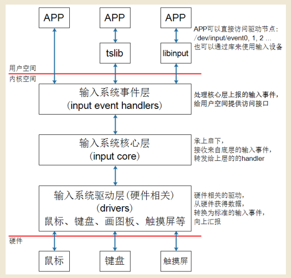
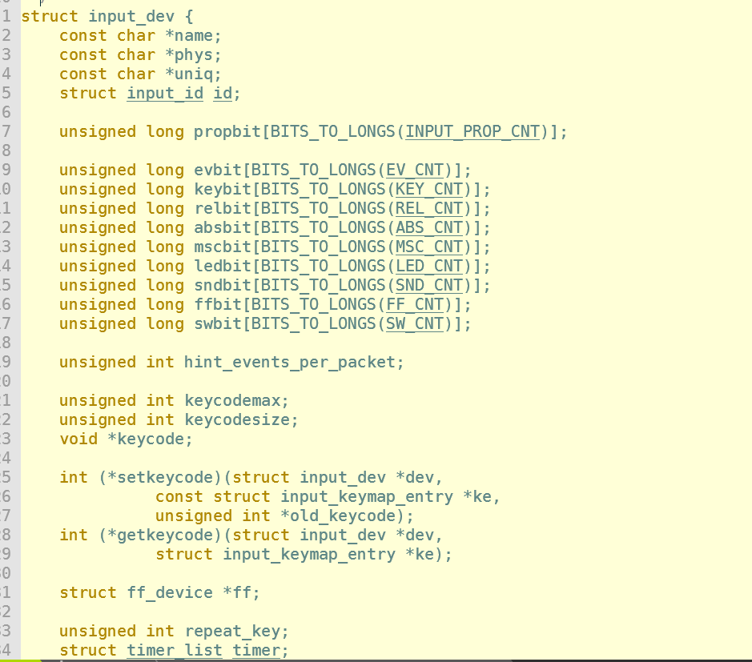

# Input Sysetm 


## 输入系统框架  




- `输入系统驱动层`

处理硬件中断。读取到数据，转换为标准的输入事件。向核心层汇报 

- `输入系统核心层`

确定把输入事件转发给上层的`handler`,也就是输入事件回调函数 

- `输入系统事件层`

确定核心层上报的输入事件，给用户空间提供访问接口 


## 编写APP必备知识 

### 1. 内核怎么表示一个输入设备 



涵盖：
```
name 设备名称
evbit 支持哪类事件
keybit 支持哪些按键 
...
```

### 2. app 可以得到什么数据 ? 

```c
struct input_event{
    struct timeval time; //发生事件的时间
    __u16 type; //事件类别
    __u16 code; //哪个事件 
    __u16 value;  //事件值 
};

struct timeval {
    __kernel_time_t tv_sec;
    __kernel_suseconds_t tv_usec; 
}


```
**APP如何知道它已经读到了完整的事件数据呢？**

答：驱动程序上报完一些列的数据后，会上报一个“同步事件”，表示数据上报完毕。


## 调试技巧 

获取输入设备节点的信息 

```
cat /proc/bus/input/devices
```

调试输入系统命令 

```
hexdump /dev/input/event0 
```
